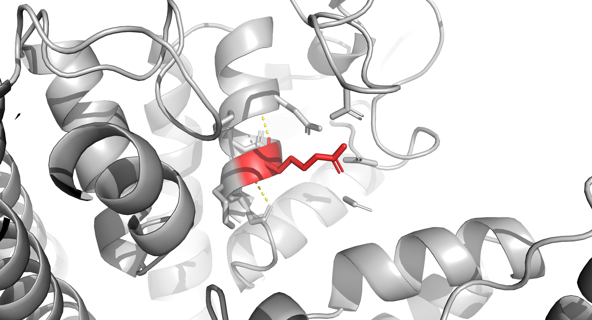

## Project Overview

This repository contains a multi-scale computational workflow designed to substantiate the pathogenicity (or lack thereof) of variants classified as pathogenic by my own automated ACMG/AMP Bayesian variant classification pipeline: [VarClass](https://www.varclass.com) 

The main target is to provide a mechanistic basis for variants previously classified as pathogenic within the pipeline's Bayesian scoring framework.



## Methodology

### Atomistic Mutation
Initial protein structures (AlphaFold-predicted) are processed to introduce point mutations using Rosetta.

```bash
python mutation_analysis.py --pdb scn5a_af.pdb --position xxx --mutation His
```

## Multi-scale Coarse-Graining (Martini 3)

***Coarse-graining (CG)**:modeling technique (multiscale) that reduces degrees of freedom in a system by grouping several atoms into a single representative bead/interaction center. Allows for simulation of much larger systems over significantly longer timescales ($\mu s$ to $ms$) than are possible with all-atom (AA) models.*

*`martinize2` converts all-atom (AA) coordinates into a CG representation compatible with the `Martini 3` force field. This defines the physical behaviour of the R376H variant in the GROMACS simulation environment.*

The resulting protein is mapped to a CG representation using `martinize2` to extend simulation timescales to the microsecond range.

* **Force Field**: Martini 3.0.0.1.

* **Parameters**: Elastic network enabled, automated disulfide bond assignment (0.24 nm constraint), and DSSP-based secondary structure assignment.

e.g., 

```
cd /gromacs/protein_simulation/variantid_SCN5A && martinize2 \
  -f scn5a_RxxxH.pdb \
  -x martinize2_output/cg_scn5a_RxxxH.pdb \
  -o martinize2_output/topol.top \
  -ff martini3001 \
  -from charmm \
  -elastic \
  -cys auto \
  -dssp \
  -ignh \
  -v 2>&1 | tee martinize2_output/martinize2.log
  ```


---

## Asymmetric Membrane Construction

An asymmetric lipid bilayer attempting to reflect a physiological cardiac membrane composition (SCN5A gene) was constructed using INSANE.

Initial:
- $X= 18.2nm$
- $Y=18.2nm$
- $Z=25.0nm$ Enough room for large extracellular loops + water

Composition:

* **Upper Leaflet**: POPC:POPE:CHOL (6:2:4)

* **Lower Leaflet**: POPC:POPE:POPS:CHOL (4:3:1:4)

* **System Size**: 18.2×18.2×25.0 nm (~750,000 particles).


```
cd /gromacs/protein_simulation/variantid_SCN5A/insane_build && \
insane \
  -f  ../martinize2_output/cg_scn5a_RxxxH.pdb \
  -o  system_cg.gro \
  -p  system_cg.top \
  -x  18.2 -y 18.2 -z 25.0 \
  -u  POPC:6 -u POPE:2 -u CHOL:4 \
  -l  POPC:4 -l POPE:3 -l POPS:1 -l CHOL:4 \
  -sol W \
  -salt 0.15 \
  -charge auto 2>&1
```

**Output:**

| Molecule Name | Total Number |
| :--- | :--- |
| Protein | 1 |
| POPC | 297 |
| POPE | 146 |
| CHOL | 236 |
| POPS | 28 |
| W (Water) | 52594 |
| NA (Sodium) | 615 |
| CL (Chloride) | 544 |

| Component | Count | Notes |
| :--- | :--- | :--- |
| Protein | 1 | 4,699 CG beads |
| **Upper leaflet** | 363 lipids | POPC: 182, POPE: 60, CHOL: 121 |
| **Lower leaflet** | 344 lipids | POPC: 115, POPE: 86, POPS: 28, CHOL: 115 |
| Water (W) | 52,594 | CG solvent |
| NA⁺ | 615 | Counter-ions |
| Cl⁻ | 544 | Counter-ions |

---

## Equilibration Strategy

The system underwent a multi-stage equilibration to ensure stability:

1. **EM**: Steepest descent to relax steric clashes

Assemble binary input:

`gmx grompp -f em.mdp -c system_cg.gro -p system_cg.top -o em.tpr -maxwarn 10 2>&1`

Run EM:

`cd /gromacs/protein_simulation/variantid_SCN5A/insane_build/em && \gmx mdrun -deffnm em -v 2>&1`

| Parameter | Value |
| :--- | :--- |
| Algorithm | Steepest Descents |
| Steps | 232 |
| Potential Energy | $-1.6497608 \times 10^{6}$ |
| Maximum force | $9.4028271 \times 10^{2}$ |
| On atom | 1788 |
| Norm of force | $3.3996128 \times 10^{1}$ |

2. **NVT Ensemble** (short, restrained): $310K$ thermalization with postion restraints - *Stabilize $T$ and relax bad contacts while $V$ constant*
3. **NPT (Berendsen - longer, restrained)**: Gradual pressure coupling to reach target density - *Let bilayer thickness/area adjust under semi-isotropic pressure coupling*

$$\mu = \left[ 1 - \frac{\beta \Delta t}{\tau_p} (P_{ref} - P) \right]^{1/3}$$

*Berendsen barostat is used to maintain constant presside during NPT ensemble simulation. It, however, functions as a weak-coupling mechanism that resizes the simulation box to counteract differences between the instantaneous pressure and target pressure.*

*The Berendsen barostat is very stable when the system is far from equilibrium. e.g., If initial density of system (say, after adding water and ions) is incorrect, the pressure can fluctuate wildly. Therefore, Berendsen is used as first-order relaxation (acts as dampener). It drives the box to target density without causing the system to crash or oscillate uncontrollably.*
*Parrinello-Rahman is then used prior to production because it allows for volume acceleration. It is prone to large, unstable oscillations if the initial pressure/density is NOT already close to target value which can lead to a `box exploded` error in GROMACS.*

1. **NPT (Parrinello-Rahman)**: Pressure coupling for production-ready tranjectories:
$$\frac{d^2 \mathbf{b}}{dt^2} = V \mathbf{b}^{-T} \mathbf{W}^{-1} (\mathbf{P} - \mathbf{P}_{ref})$$

$$\mathbf{W}^{-1} = \frac{4 \pi^2 \beta}{3 \tau_p^2 L}$$

**NPT_4 run (unrestrained) Parrinello-Rahman:**

| Energy Component | Value (kJ/mol) |
| :--- | :--- |
| Bond | $1.66893 \times 10^{4}$ |
| Angle | $6.89838 \times 10^{3}$ |
| G96Angle | $3.85331 \times 10^{3}$ |
| Restr. Angles | $6.32355 \times 10^{3}$ |
| Proper Dih. | $5.63224 \times 10^{3}$ |
| Improper Dih. | $3.27365 \times 10^{2}$ |
| LJ (SR) | $-1.59129 \times 10^{6}$ |
| Coulomb (SR) | $-1.59357 \times 10^{4}$ |
| Potential | $-1.56750 \times 10^{6}$ |
| Kinetic En. | $2.47198 \times 10^{5}$ |
| Total Energy | $-1.32030 \times 10^{6}$ |
| Conserved En. | $-1.35166 \times 10^{6}$ |

| Thermodynamic Property | Value |
| :--- | :--- |
| Temperature | 310.020 K |
| Pressure | 0.873516 bar |
| Constr. rmsd | 0.00000 |
| Box-X | 15.2355 nm |
| Box-Y | 15.2355 nm |
| Box-Z | 31.6605 nm |
| T-Solute | 310.081 K |
| T-Solvent | 310.008 K |

---

## Back-mapping (CG2AT)

*CG2AT is a computational tool used for back-mapping the process of converting a coarse-grained (CG) molecular representation back into an all-atom (AA) representation (reverse `martinize2`). Martini 3 allows for long-timescale simulations but it lacks high-resolution atomic detail required to observe specific side-chain interactions, hydrogen bonding networks or ligand binding pockets.*

To recover atomic resolution for high fidelity interaction analysis, CGs are back-mapped to **CHARMM36** force field.

* Align atomistic fragments to CG bead centers of mass:

$$\mathbf{R}_i = \frac{\sum_{j \in I} m_j \mathbf{r}_j}{\sum_{j \in I} m_j}$$

* EM and position-restrained MD to resolve clashed:

$$\nabla V(\mathbf{r}_1, \mathbf{r}_2, \dots, \mathbf{r}_N) = 0$$

---

### Up to this point all computation had been done on Apple silicon 10-12 CPUS (M4,32GB and M2,16GB RAM, respectively). Small soluble proteins were simulated on an Ubuntu machine with 8 CPUs, GPU RTX 3060 mobile, 40GB RAM.

### For an all-atom NVT and NPT - followed by unrestrained equilibration and lastly production - this approach was not feasible since it would take many hours/days maxing out all cores on Apple silicon and would most likely overheat the Ubuntu machine (while maxing out CPU and GPU usage) after just a couple of hours.

### I therefore moved to an Ubuntu cloud instance with GPU H100 Hopper, 16 CPUs, 200GB RAM 🥵😮‍💨

---

*After CG2AT, the result is a new physical model (all-atom CHARMM36) with new degrees of freedom, new constraints, and new local geometry. This system is a **higher-resolution** of the same state, i.e, it is a different Hamiltonian and a different coordinate representation.*

e.g., 


**NPT (restrained):**

| Energy Component | Value (kJ/mol) |
| :--- | :--- |
| Bond | $6.74125 \times 10^{4}$ |
| U-B | $2.90969 \times 10^{5}$ |
| Proper Dih. | $2.25762 \times 10^{5}$ |
| Improper Dih. | $6.01497 \times 10^{3}$ |
| CMAP Dih. | $-2.38950 \times 10^{3}$ |
| LJ-14 | $5.17442 \times 10^{4}$ |
| Coulomb-14 | $2.96708 \times 10^{5}$ |
| LJ (SR) | $7.51931 \times 10^{5}$ |
| Coulomb (SR) | $-1.08146 \times 10^{7}$ |
| Coul. recip. | $3.66863 \times 10^{4}$ |
| Position Rest. | $1.97214 \times 10^{4}$ |
| Potential | $-9.07004 \times 10^{6}$ |
| Kinetic En. | $1.97720 \times 10^{6}$ |
| Total Energy | $-7.09284 \times 10^{6}$ |
| Conserved En. | $-6.99197 \times 10^{6}$ |

| Thermodynamic Property | Value |
| :--- | :--- |
| Temperature | 310.013 K |
| Pressure | 0.706757 bar |
| Constr. rmsd | 0.00000 |
| Box-X | 15.1717 nm |
| Box-Y | 15.1717 nm |
| Box-Z | 31.7795 nm |

- Performance: 50.3 ns/day
- Completed 1 ns in ~29 min on H100.
- **For context** this would have taken ~20 hours on Apple Silicon maxing out all CPUs (probably I don't fact check).
