## Project Overview

This repository contains a multi-scale computational workflow designed to substantiate the pathogenicity (or lack thereof) of variants classified as pathogenic by my own automated ACMG/AMP Bayesian variant classification pipeline: [VarClass](https://www.varclass.com) 

The main target is to provide a mechanistic basis for variants previously classified as pathogenic within the pipeline's Bayesian scoring framework.

### Wild-Type:

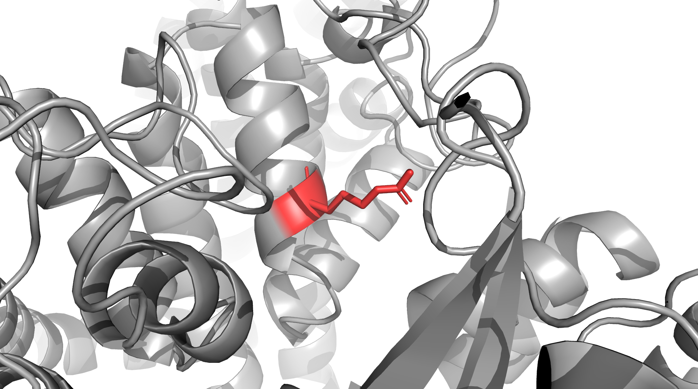

### Mutant:

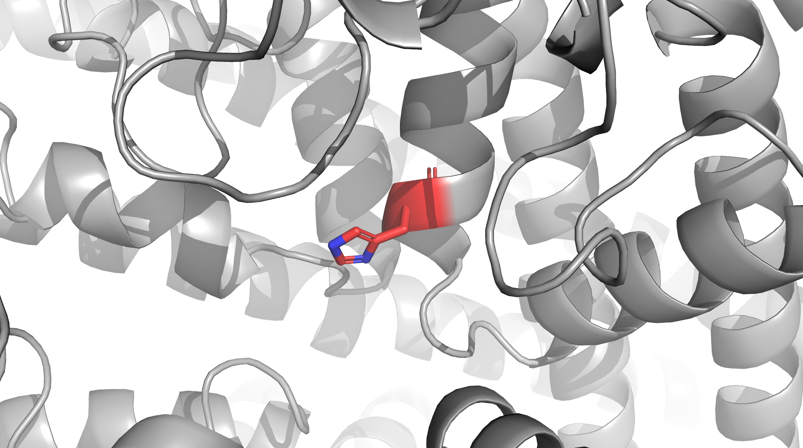

## Methodology

### Atomistic Mutation
Initial protein structures (AlphaFold-predicted) are processed to introduce point mutations using Rosetta.

```bash
python mutation_analysis.py --pdb scn5a_af.pdb --position xxx --mutation His
```

## Multi-scale Coarse-Graining (Martini 3)

***Coarse-graining (CG)**:modeling technique (multiscale) that reduces degrees of freedom in a system by grouping several atoms into a single representative bead/interaction center. Allows for simulation of much larger systems over significantly longer timescales ($\mu s$ to $ms$) than are possible with all-atom (AA) models.*

*`martinize2` converts all-atom (AA) coordinates into a CG representation compatible with the `Martini 3` force field. This defines the physical behaviour of the RxxxH variant in the GROMACS simulation environment.*

The resulting protein is mapped to a CG representation using `martinize2` to extend simulation timescales to the microsecond range.

* **Force Field**: Martini 3.0.0.1.

* **Parameters**: Elastic network enabled, automated disulfide bond assignment (0.24 nm constraint), and DSSP-based secondary structure assignment.

e.g., 

```
cd /gromacs/protein_simulation/variantid_SCN5A && martinize2 \
  -f scn5a_RxxxH.pdb \
  -x martinize2_output/cg_scn5a_RxxxH.pdb \
  -o martinize2_output/topol.top \
  -ff martini3001 \
  -from charmm \
  -elastic \
  -cys auto \
  -dssp \
  -ignh \
  -v 2>&1 | tee martinize2_output/martinize2.log
  ```


---

## Asymmetric Membrane Construction

An asymmetric lipid bilayer attempting to reflect a physiological cardiac membrane composition (SCN5A gene) was constructed using INSANE.

Initial:
- $X= 18.2nm$
- $Y=18.2nm$
- $Z=25.0nm$ Enough room for large extracellular loops + water

Composition:

* **Upper Leaflet**: POPC:POPE:CHOL (6:2:4)

* **Lower Leaflet**: POPC:POPE:POPS:CHOL (4:3:1:4)

* **System Size**: 18.2×18.2×25.0 nm (~750,000 particles).


```
cd /gromacs/protein_simulation/variantid_SCN5A/insane_build && \
insane \
  -f  ../martinize2_output/cg_scn5a_RxxxH.pdb \
  -o  system_cg.gro \
  -p  system_cg.top \
  -x  18.2 -y 18.2 -z 25.0 \
  -u  POPC:6 -u POPE:2 -u CHOL:4 \
  -l  POPC:4 -l POPE:3 -l POPS:1 -l CHOL:4 \
  -sol W \
  -salt 0.15 \
  -charge auto 2>&1
```

**Output:**

| Molecule Name | Total Number |
| :--- | :--- |
| Protein | 1 |
| POPC | 297 |
| POPE | 146 |
| CHOL | 236 |
| POPS | 28 |
| W (Water) | 52594 |
| NA (Sodium) | 615 |
| CL (Chloride) | 544 |

| Component | Count | Notes |
| :--- | :--- | :--- |
| Protein | 1 | 4,699 CG beads |
| **Upper leaflet** | 363 lipids | POPC: 182, POPE: 60, CHOL: 121 |
| **Lower leaflet** | 344 lipids | POPC: 115, POPE: 86, POPS: 28, CHOL: 115 |
| Water (W) | 52,594 | CG solvent |
| NA⁺ | 615 | Counter-ions |
| Cl⁻ | 544 | Counter-ions |

---

## Equilibration Strategy

The system underwent a multi-stage equilibration to ensure stability:

1. **EM**: Steepest descent to relax steric clashes

Assemble binary input:

`gmx grompp -f em.mdp -c system_cg.gro -p system_cg.top -o em.tpr -maxwarn 10 2>&1`

Run EM:

`cd /gromacs/protein_simulation/variantid_SCN5A/insane_build/em && \gmx mdrun -deffnm em -v 2>&1`

| Parameter | Value |
| :--- | :--- |
| Algorithm | Steepest Descents |
| Steps | 232 |
| Potential Energy | $-1.6497608 \times 10^{6}$ |
| Maximum force | $9.4028271 \times 10^{2}$ |
| On atom | 1788 |
| Norm of force | $3.3996128 \times 10^{1}$ |

2. **NVT Ensemble** (short, restrained): $310K$ thermalization with postion restraints - *Stabilize $T$ and relax bad contacts while $V$ constant*
3. **NPT (Berendsen - longer, restrained)**: Gradual pressure coupling to reach target density - *Let bilayer thickness/area adjust under semi-isotropic pressure coupling*

$$\mu = \left[ 1 - \frac{\beta \Delta t}{\tau_p} (P_{ref} - P) \right]^{1/3}$$

*Berendsen barostat is used to maintain constant presside during NPT ensemble simulation. It, however, functions as a weak-coupling mechanism that resizes the simulation box to counteract differences between the instantaneous pressure and target pressure.*

*The Berendsen barostat is very stable when the system is far from equilibrium. e.g., If initial density of system (say, after adding water and ions) is incorrect, the pressure can fluctuate wildly. Therefore, Berendsen is used as first-order relaxation (acts as dampener). It drives the box to target density without causing the system to crash or oscillate uncontrollably.*
*Parrinello-Rahman is then used prior to production because it allows for volume acceleration. It is prone to large, unstable oscillations if the initial pressure/density is NOT already close to target value which can lead to a `box exploded` error in GROMACS.*

1. **NPT (Parrinello-Rahman)**: Pressure coupling for production-ready tranjectories:
$$\frac{d^2 \mathbf{b}}{dt^2} = V \mathbf{b}^{-T} \mathbf{W}^{-1} (\mathbf{P} - \mathbf{P}_{ref})$$

$$\mathbf{W}^{-1} = \frac{4 \pi^2 \beta}{3 \tau_p^2 L}$$

**NPT_4 run (unrestrained) Parrinello-Rahman:**

| Energy Component | Value (kJ/mol) |
| :--- | :--- |
| Bond | $1.66893 \times 10^{4}$ |
| Angle | $6.89838 \times 10^{3}$ |
| G96Angle | $3.85331 \times 10^{3}$ |
| Restr. Angles | $6.32355 \times 10^{3}$ |
| Proper Dih. | $5.63224 \times 10^{3}$ |
| Improper Dih. | $3.27365 \times 10^{2}$ |
| LJ (SR) | $-1.59129 \times 10^{6}$ |
| Coulomb (SR) | $-1.59357 \times 10^{4}$ |
| Potential | $-1.56750 \times 10^{6}$ |
| Kinetic En. | $2.47198 \times 10^{5}$ |
| Total Energy | $-1.32030 \times 10^{6}$ |
| Conserved En. | $-1.35166 \times 10^{6}$ |

| Thermodynamic Property | Value |
| :--- | :--- |
| Temperature | 310.020 K |
| Pressure | 0.873516 bar |
| Constr. rmsd | 0.00000 |
| Box-X | 15.2355 nm |
| Box-Y | 15.2355 nm |
| Box-Z | 31.6605 nm |
| T-Solute | 310.081 K |
| T-Solvent | 310.008 K |

---

## Back-mapping (CG2AT)

*CG2AT is a computational tool used for back-mapping the process of converting a coarse-grained (CG) molecular representation back into an all-atom (AA) representation (reverse `martinize2`). Martini 3 allows for long-timescale simulations but it lacks high-resolution atomic detail required to observe specific side-chain interactions, hydrogen bonding networks or ligand binding pockets.*

To recover atomic resolution for high fidelity interaction analysis, CGs are back-mapped to **CHARMM36** force field.

* Align atomistic fragments to CG bead centers of mass:

$$\mathbf{R}_i = \frac{\sum_{j \in I} m_j \mathbf{r}_j}{\sum_{j \in I} m_j}$$

* EM and position-restrained MD to resolve clashed:

$$\nabla V(\mathbf{r}_1, \mathbf{r}_2, \dots, \mathbf{r}_N) = 0$$

---

***Up to this point all computation had been done on Apple silicon (M4 with 10 CPUs and 32GB RAM; M2 with 12 CPUs and 16GB RAM). Small soluble proteins were simulated on an Ubuntu machine with 8 CPUs, RTX 3060 GPU, and 40GB RAM.
For an all-atom NVT and NPT ensembles - followed by unrestrained equilibration and lastly production - this approach was not feasible as it would take several days on that hardware.
The remaining tasks were completed on Ubuntu cloud instance with an H100 Hopper GPU, 16 CPUs, and 200GB RAM.***

---

*After CG2AT, the result is a new physical model (all-atom CHARMM36) with new degrees of freedom, new constraints, and new local geometry. This system is a **higher-resolution** of the same state, i.e, it is a different Hamiltonian and a different coordinate representation.*

EM and equilibration are needed again because CG averages out the fine details such as hydrogen bond geometries, salt bridge distances, etc. After reconstruction, all these degrees of freedom are introduced but their initial baselines are rather approximations. This ensures that any final interpretation of the results is not due to a back mapping artifact. 

...

## PRODUCTION MUTANT:

| Stage                      | Sim. Time | Steps       | dt (ps) | Wall Clock     | Performance   | Start → Finish                      |
|----------------------------|-----------|-------------|---------|----------------|---------------|--------------------------------------|
| Energy Minimization        | —         | 50,000 max  | —       | ~13 min        | —             | Feb 12, 20:00 → 20:14               |
| NVT Equilibration          | 0.5 ns    | 250,000     | 0.002   | ~1 min 46 s    | 1.17 ns/day*  | Feb 12, 21:28 → 21:30               |
| NPT Restrained             | 5.0 ns    | 2,500,000   | 0.002   | ~2 h 12 min    | 54.5 ns/day   | Feb 14 (logged in npt_run.log)       |
| NPT Unrestrained           | 6.0 ns    | 3,000,000   | 0.002   | 3 h 01 min     | 47.8 ns/day   | Feb 14, 23:05 → Feb 15, 02:06       |
| **Production**             | **10.0 ns** | **5,000,000** | **0.002** | **5 h 17 min** | **45.4 ns/day** | **Feb 15, 02:45 → 08:02**       |

- Total Simulation Wall Time: ~10 h 44 min  
- Total Simulated Time: 21.5 ns (0.5 + 5.0 + 6.0 + 10.0 ns)

## PRODUCTION WILD-TYPE:

Rather than repeating the entire CG $\rightarrow$ AA pipeline for the WT, I did a back mutation. Using the final equilibrated mutant production frame and replacing the mutant residue with the wt. THe placement of the wt residue caused steric clashes with the surrouning atoms.
THE system was gradually equilibrated to gently relax WT structure by slowly increasing timesteps and introduction of pressure. $4$ equilibration stages were used before produciton:

| Stage | Ensemble | $dt$ (fs) | Duration | Barostat | $\tau_p$ (ps) | LINCS (Iter/Order) |
| :--- | :--- | :--- | :--- | :--- | :--- | :--- |
| **Energy Min** | N/A | N/A | 18 steps | None | N/A | N/A |
| **Stage 1: NVT Relaxation** | NVT | 0.5 | 100 ps | None | N/A | 2 / 6 |
| **Stage 2a: Pressure Intro** | NPT | 0.5 | 50 ps | Berendsen | 20.0 | 2 / 6 |
| **Stage 2b: Intermediate** | NPT | 1.0 | 100 ps | Berendsen | 10.0 | 2 / 6 |
| **Stage 3: NPT Equilibration** | NPT | 1.0 | 1 ns | C-rescale | 5.0 | 2 / 6 |
| **Production Run** | NPT | 2.0 | 10 ns | C-rescale | 5.0 | N/A |

| Parameter | Value |
|-----------|-------|
| dt | 2.0 fs |
| Duration | 10 ns (5,000,000 steps) |
| Barostat | C-rescale, semiisotropic, τ_p = 5.0 ps |
| Thermostat | V-rescale, τ = 1.0 ps, T = 310 K |
| Position restraints | **None** (unrestrained production) |
| GPU update | Yes (enabled after confirming equilibration stability) |
| Performance | **49.8 ns/day** |
| Average Temperature | 310.03 K |
| Average Pressure | 1.40 bar |
| Average Potential Energy | −9.120 × 10⁶ kJ/mol |
| Average Density | 1018.0 kg/m³ |
| Box Dimensions | 15.63 × 15.63 × 30.00 nm |
| Total Atoms | 743,194 |
| Energy drift | 2.43 × 10⁻⁴ kJ/mol/ps per atom |

## WT vs. Mutant

Comparison of $10$ $ns$ production trajectories for WT and mutant systems:

### Principal Component

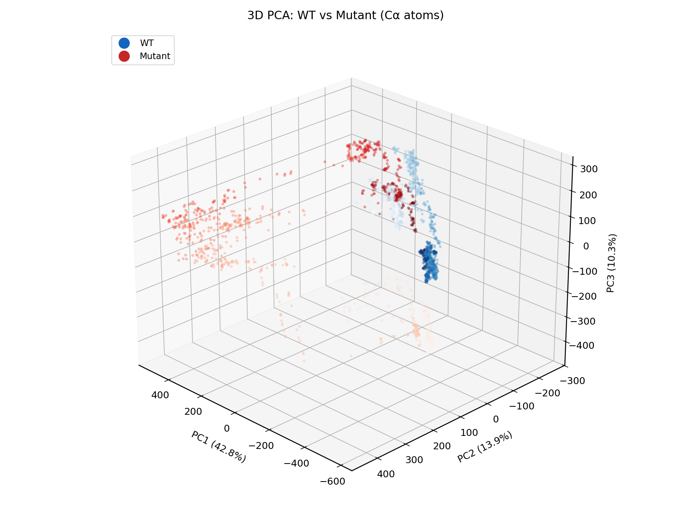

---

### Structural Stability

Backbone RMSD over production run $\rightarrow$ mutant shows higher deviation from starting structure. May indicate reduced conformational stability.
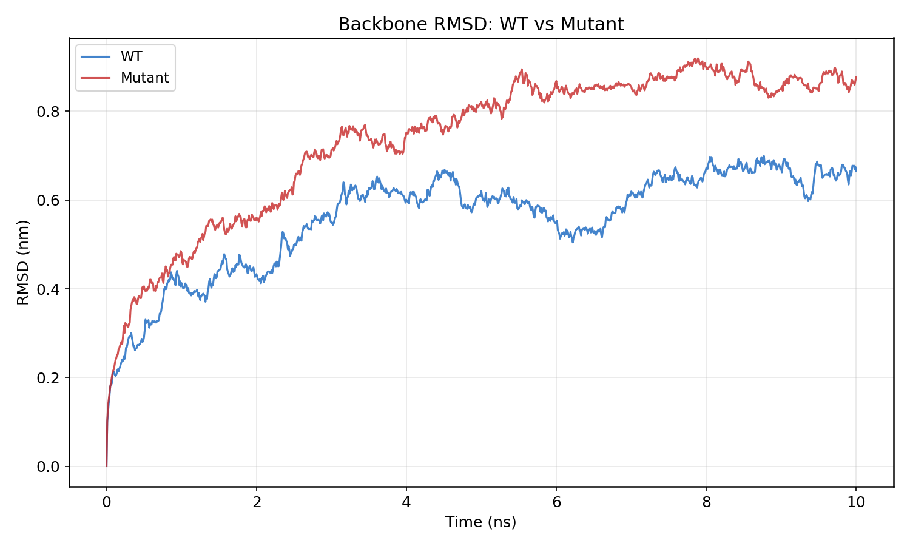

### Per-Residue Flexibility

RMSF per residue.

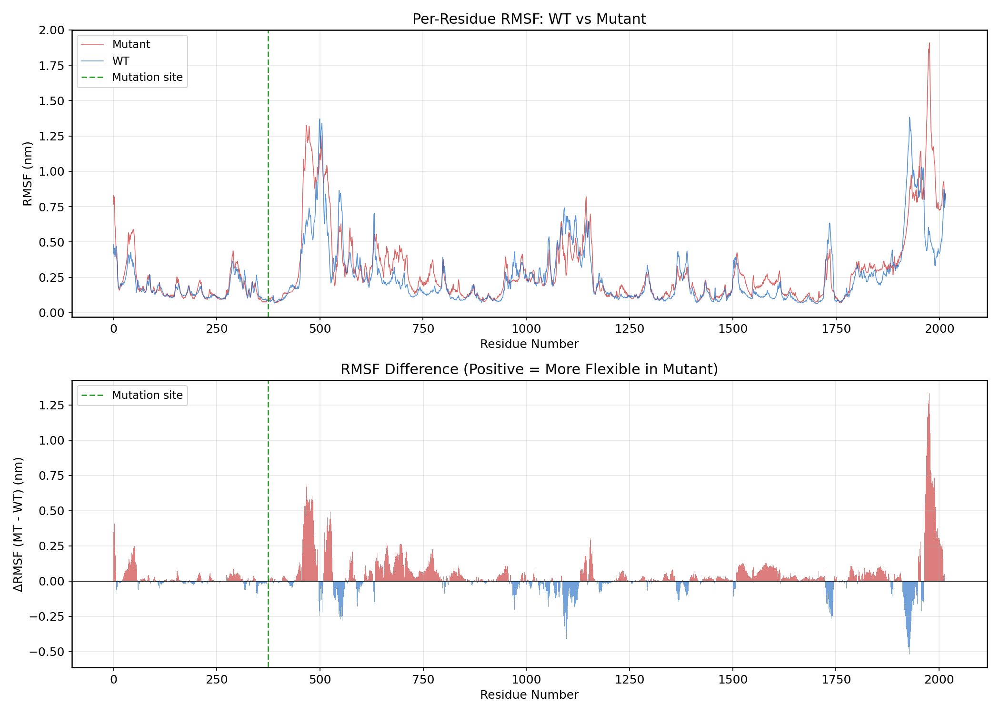

Zoomed in view around mutation site

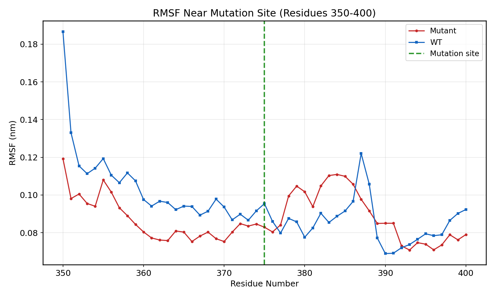

### Radius of Gyration

Compactness of protein over time. 

Larger $R_g$ in mutant $\Rightarrow$ partial unfolding or domain separation

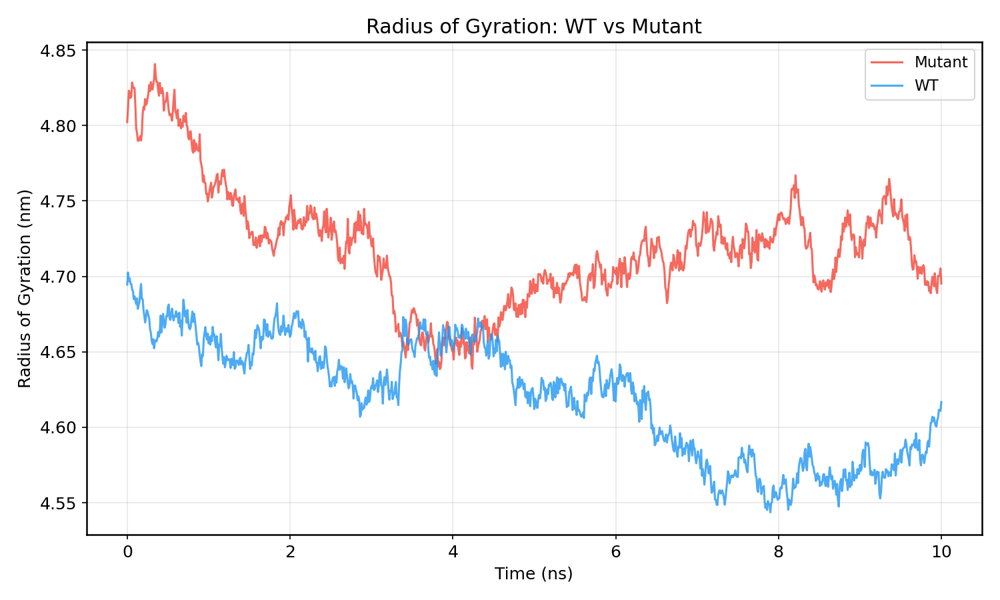

### Backbone Dihedral Landscape (Ramachandran)


Red density in areas that are usually less populated more support that mutation increases backbone flexibility.

### Hydrogen Bonds

Intramolecular hydrogen bonds over time

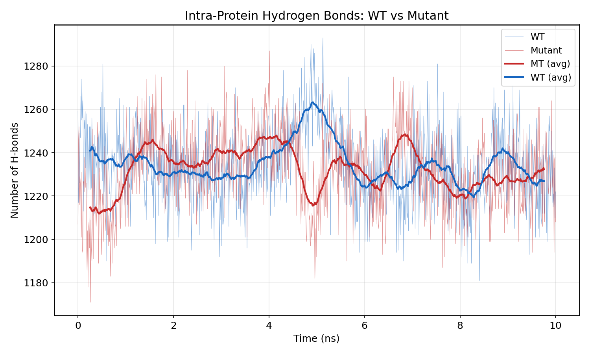

### Thermo properties

Potential energy, temperature, pressure, and density for both systems

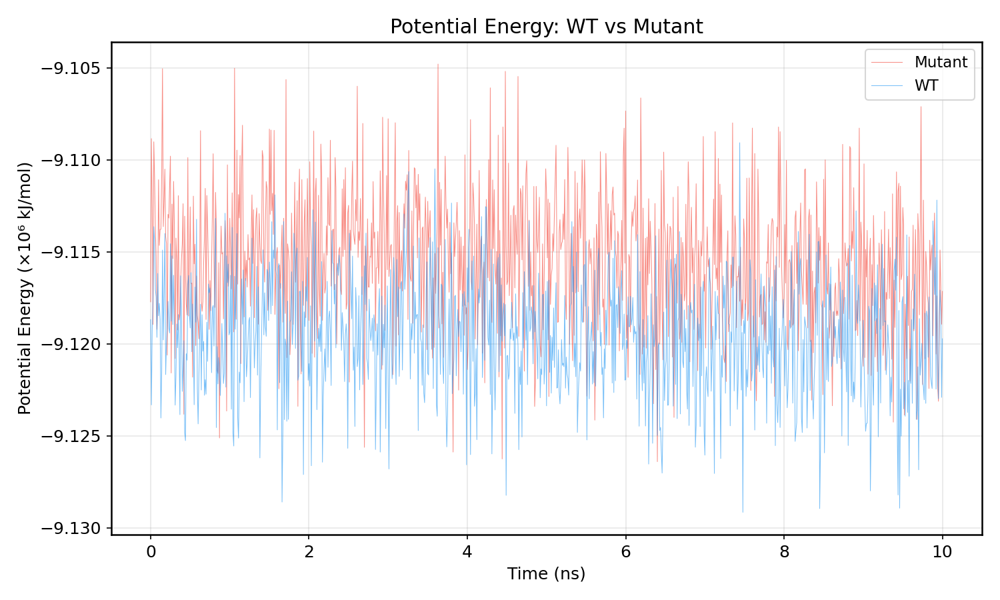

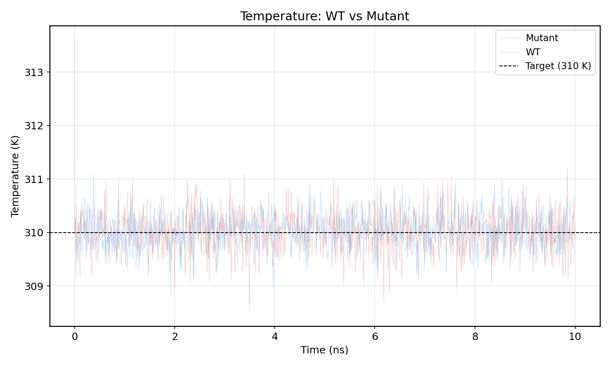

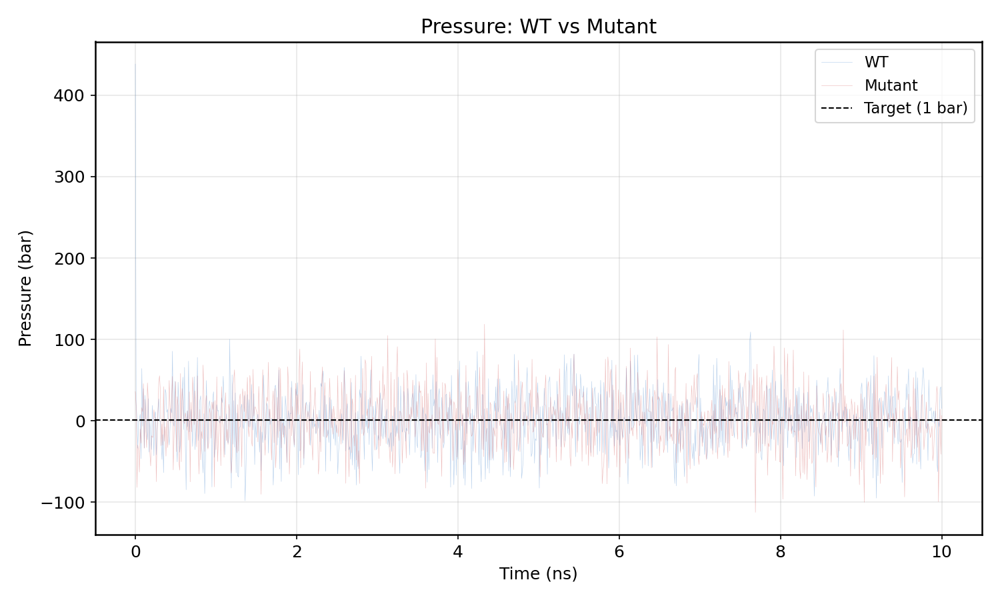

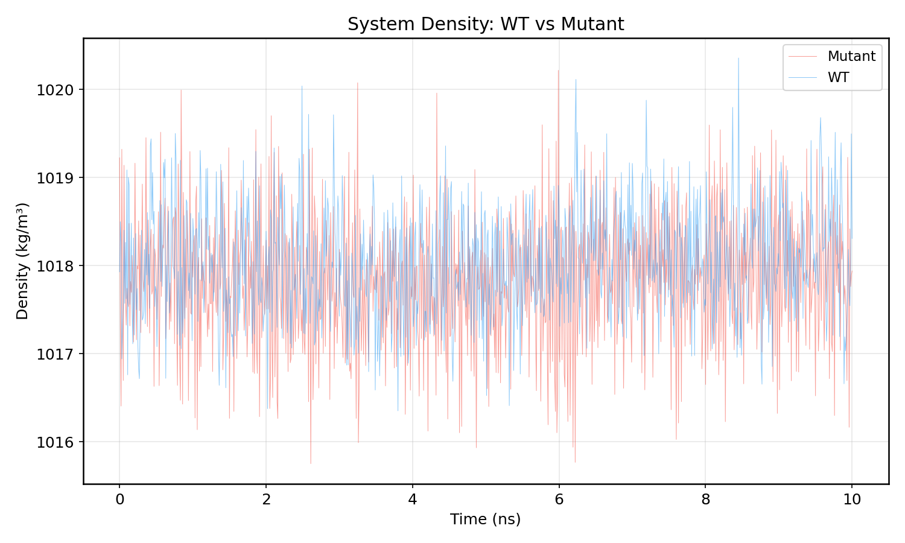

### System-lvl specs

Total energy, area per lipid, box dimensions over production trajectory

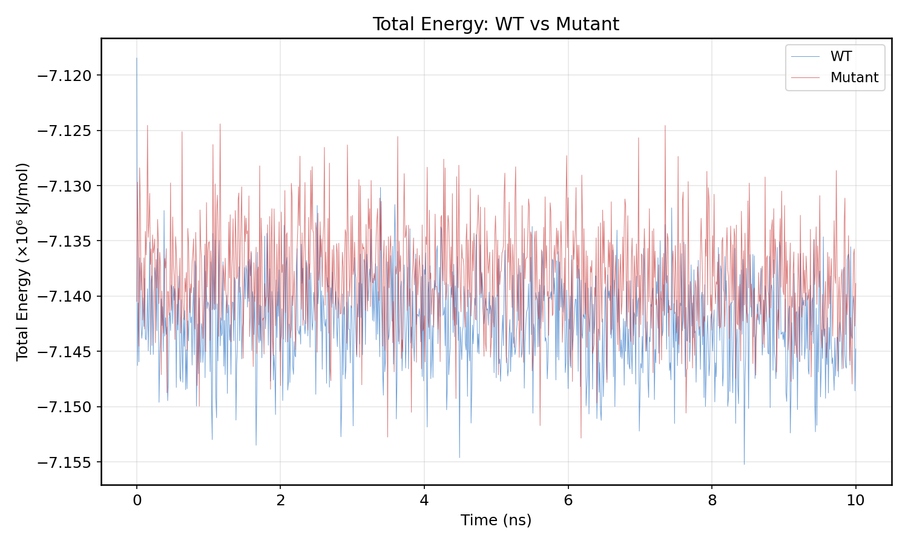

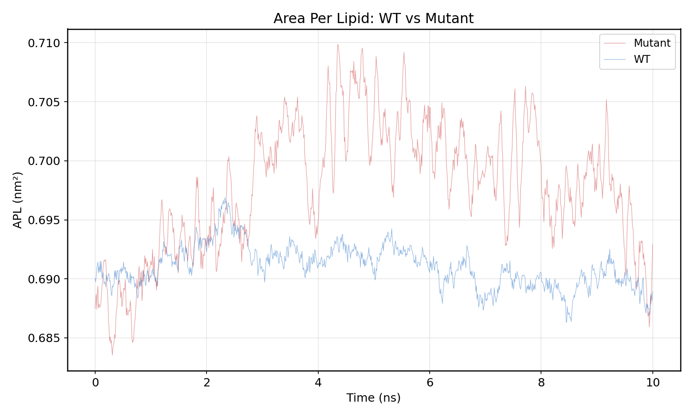

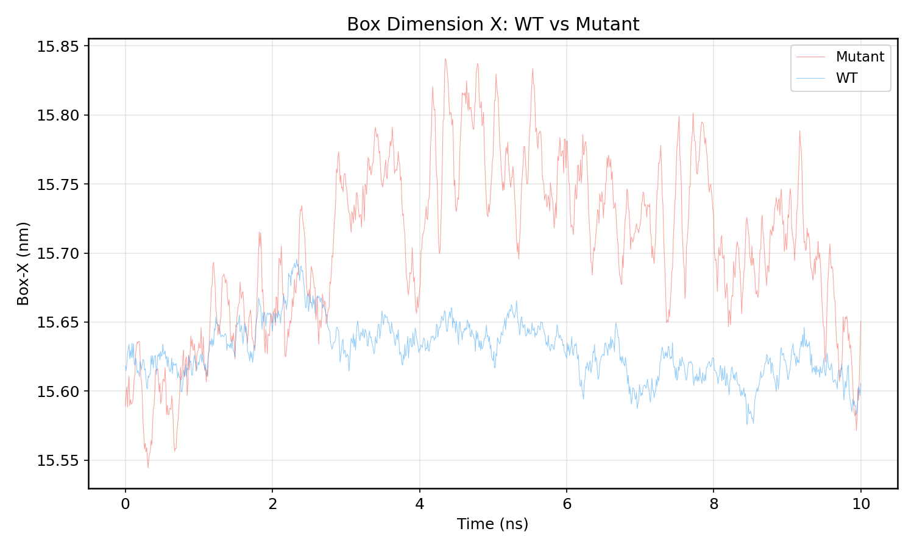

---

## MD and Monte Carlo

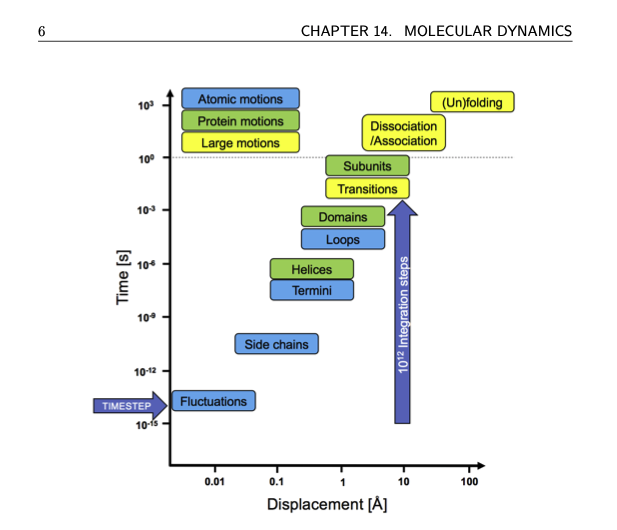

Source: [Molecular Dynamics](https://arxiv.org/abs/2307.02176) and [Monte Carlo](https://arxiv.org/abs/2307.02177)

For a large protein like $SCN5A$ ($Na_v 1.5$), $10ns$ is not enough because most relevant motions occur on a much longer timescale. Protein transitions involving protein domains/subunits usually occur in the range of micro seconds to seconds. For motion of domain size parts or large scale conformational transitions $\rightarrow$ milliseconds to seconds and for protein folding seconds (fast folders in milliseconds).

10ns is therefore not anough to capture funcitonal domain rearrangements or folding euilibria relevant to a complex chanell like $SCN5A$.


## Hamiltonian Replica Exchange Monte Carlo (HREMC)

- Map all-atom last snapshots (production results) to Martini3 (`martinize2`) $\rightarrow$ CG representation

```
cd /extended_simulation && /anaconda3/bin/martinize2 \
  -f /scn5a_af.pdb \
  -x wt_cg/cg_wt_go.pdb \
  -o wt_cg/topol_wt_go.top \
  -ff martini3001 \
  -from charmm \
  -dssp \
  -ignh \
  -name Protein_wt \
  -go \
  -go-eps 9.414 \
  -p backbone \
  -pf 1000 \
  2>&1 | tee /tmp/martinize_wt_go.log | tail -30
```

- CG $\rightarrow$ INSANE $\rightarrow$ CG protein $+$ Martini3 membrane $=$ **Martini 3 CG with Go-model**
- Run equilibration locally on Mac Mini
- HREMC ran on 3x A5000Pro, 96 CPUs, 192GB RAM. ~11hrs each WT and Mutant.

---

- **Due to kinetic bottlenecks in the simulation:**

## CG HREMC Local MSM Comparison

### WT

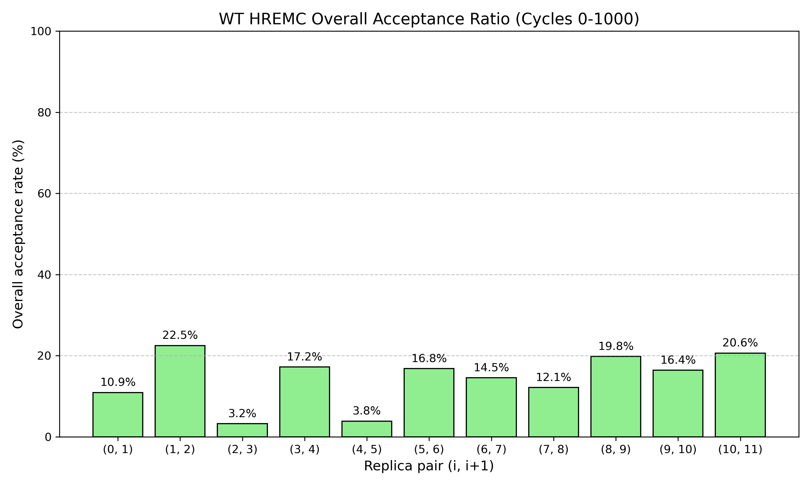

| | |
|---|---|
|  |  |

The WT 12-replica ladder was fragmented into 3 blocks:

- **WT MSM Block 1**: Replicas 0, 1, and 2. Block_1 is bounded by 3.2% exchange rate at interface (2, 3).

- **WT MSM Block 2**: Replicas 3 and 4. Block_2 is bounded by 3.2% exchange rate at interface (2, 3) and 3.8% exchange rate at interface (4, 5).

- **WT MSM Block 3**: Replicas 5, 6, 7, 8, 9, 10, and 11. Block_3 is bounded by 3.8% exchange rate at interface (4, 5). All subsequent interfaces maintain acceptance rates above 12.0%.

***Block_2 was excluded after local transition count matrices step***

```msm_block2 (1960 frames):
    Total counts       : 1,950
    Non-zero entries   : 230
    Sparsity           : 0.9942
    Self-transition %  : 65.1%
    Visited states     : 75
    Connected comp.    : 126
    Largest SCC        : 9
```

1. Local free energy difference mapping:

**NATIVE:**

```
  msm_block1:
    Local SCC states    = 53
    λ₁ (rev)            = 0.999999999999995
    λ₁ (nonrev)         = 1.000000000000006
    min(π_rev)          = 8.880995e-04
    max(π_rev)          = 5.861456e-02
    H(π_rev)            = 3.5951  (efficiency = 0.9055)
```

$H_{max}=ln(53) \approx 3.9703$ whereas $H(\pi_{rev})=3.5951$ Therefore efficiency $\frac{H}{ln53}=0.9055$
Thus probability mass is well distributed and no state dominates. $max(\pi_{rev}) \approx 5.9$% and $min(\pi_{rev})\approx 0.09$%.


**UNFOLDED/HIGH ENERGY BASIN:**

```
  msm_block3:
    Local SCC states    = 175
    λ₁ (rev)            = 1.000000000000002
    λ₁ (nonrev)         = 1.000000000000006
    min(π_rev)          = 1.459854e-04
    max(π_rev)          = 2.072993e-02
    H(π_rev)            = 4.9162  (efficiency = 0.9519)
```

$H(\pi_{rev})\approx 0.9519$ 

Flatter and rugged energy landscape $\rightarrow$ disordered conformation/unfolded/not stable


| | |
|---|---|
| 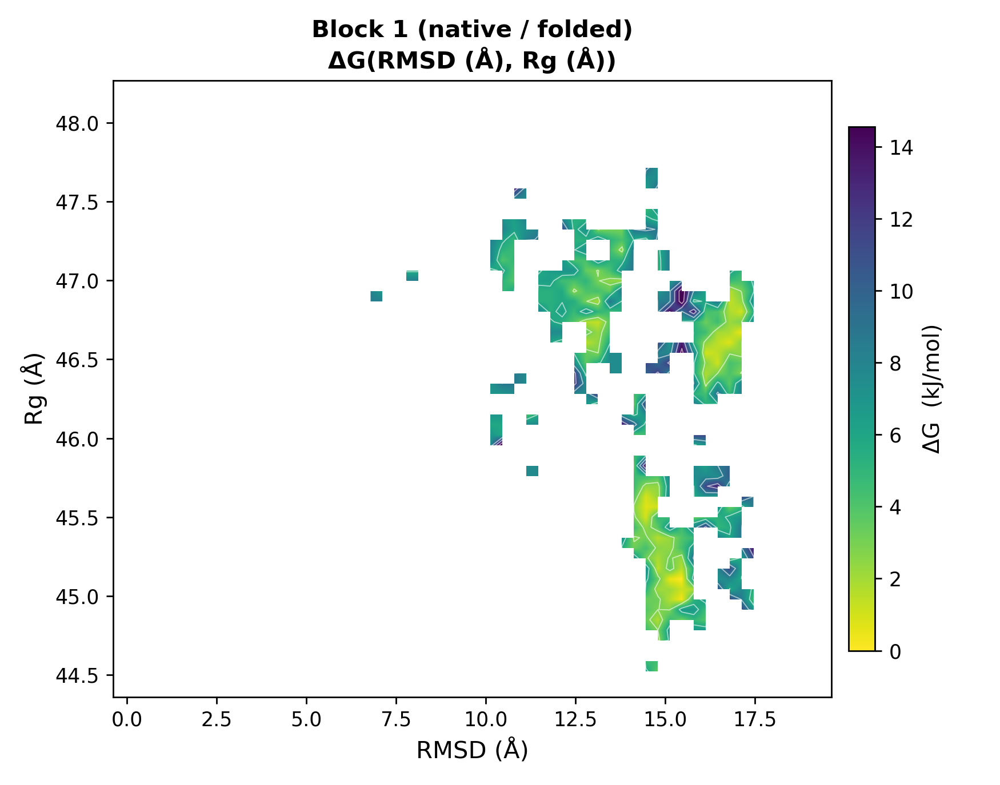 | 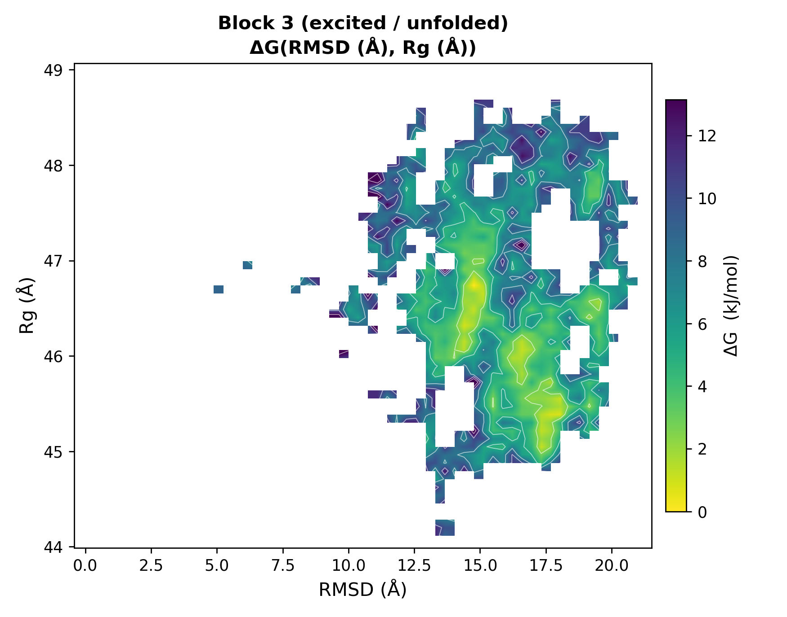 |

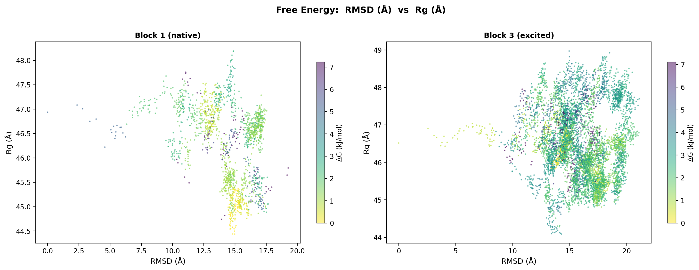

---

### MUTANT

Bottlenecks and way worse than WT:


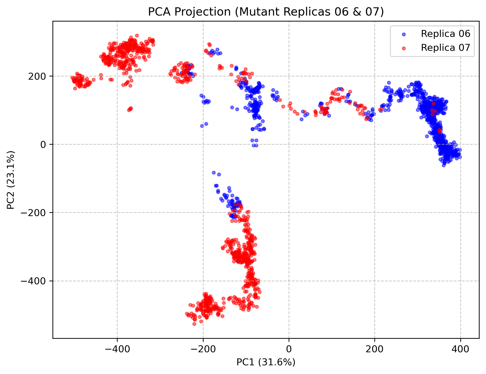

- **Mutant MSM Block 1 (Native Basin)**: Replicas 0 and 1.

- **Mutant MSM Block 2 (Intermediate Basin)**: Replicas 3 and 4.

- **Mutant MSM Block 3 (Unfolded Basin)**: Replicas 7, 8, 9, 10, and 11.


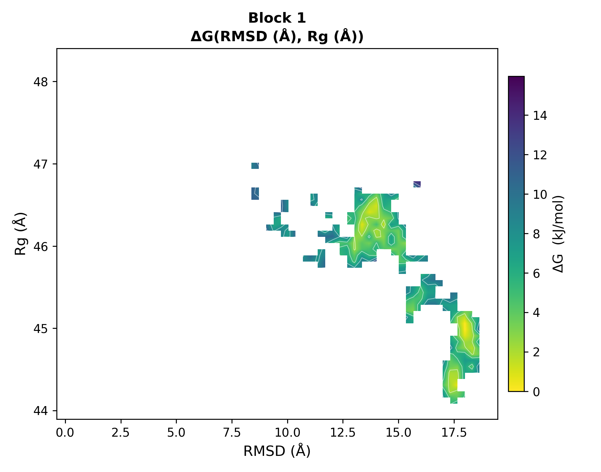

| | |
|---|---|
| 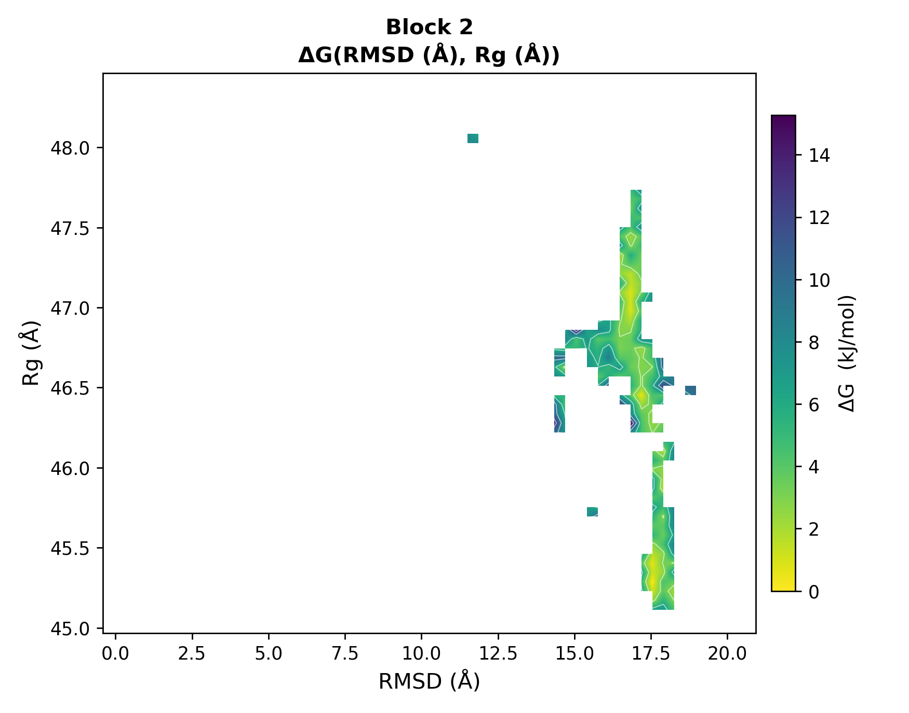 | 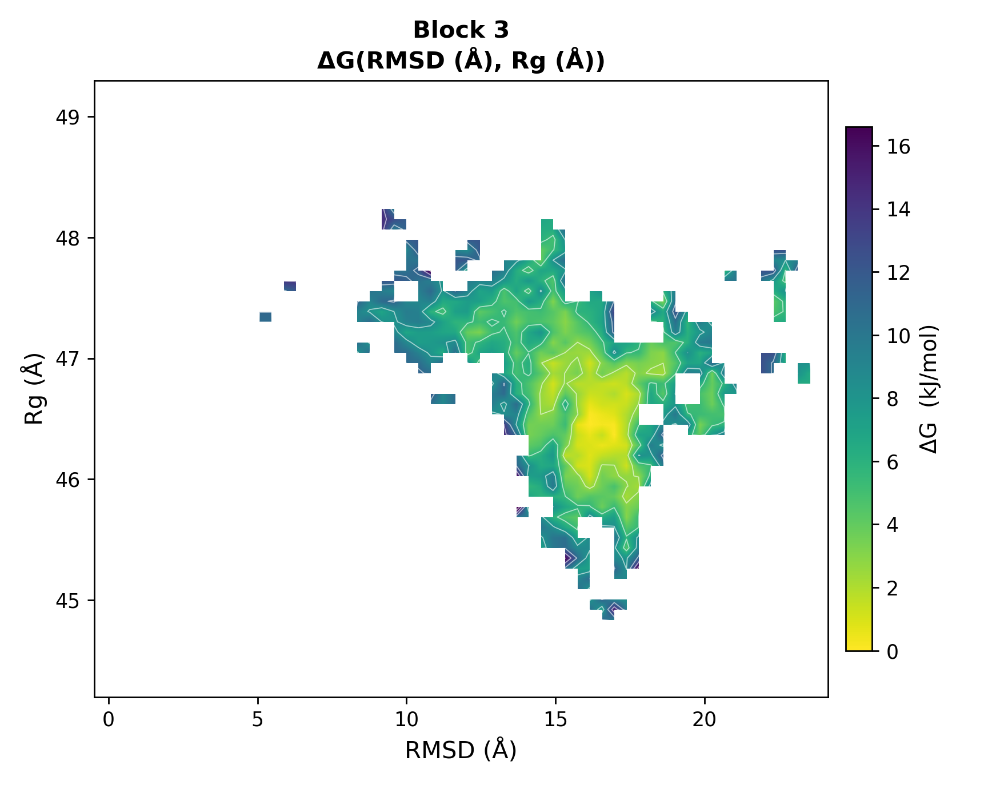 |


--- 

To calculate difference matrix (WT vs Mutant block 1 and block 3), WT was ran again with the same block composition as mutant. 
